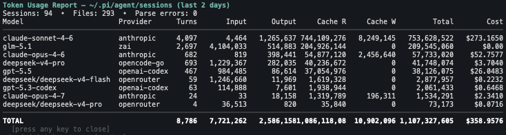
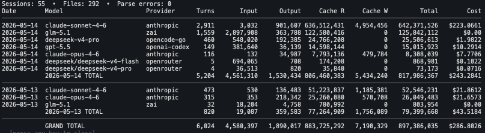

# pi-token-usage

A [Pi coding agent](https://pi.dev) extension that

- analyzes token usage and cost across your session files
- prunes old sessions files on demand



*Aggregated view (default)*



*Daily breakdown (`--daily`)*

## Installation

```bash
# NPM (recommended)
pi install npm:@alexanderfortin/pi-token-usage

# Git
pi install git:github.com/shaftoe/pi-token-usage

# Or quick-test without installing
pi -e ./pi-token-usage/src/index.ts
```

## Usage

### Report Command

```
/token-report                                  Report all sessions (table in TUI)
/token-report 7                                Last 7 days
/token-report /path/to/dir                     Specific directory or file
/token-report --format csv                     CSV to stdout
/token-report --format csv --save report.csv   Save CSV to file
/token-report 7 --format json                  JSON to stdout
/token-report --format md                      Markdown to stdout
/token-report --format markdown --save out.md  Save Markdown to file
/token-report --format=csv --save=out.csv      Equals-sign syntax also works
/token-report --daily                          Daily breakdown by date × model
/token-report 7 --daily                        Daily breakdown for last 7 days
/token-report --daily --format csv             Daily CSV output
/token-report 7 --daily --format json          Daily JSON output
```

### Prune Command

```
/token-prune 30                    Delete sessions older than 30 days
/token-prune 30 --dry-run          Show what would be deleted without actually deleting
/token-prune 60 --path /custom/dir Prune a specific directory
/token-prune 100 --force           Skip confirmation prompt for large deletions
```

### Report Arguments

| Argument | Description |
|----------|-------------|
| `[days]` | Number — show sessions from the last N days |
| `[path]` | Path to a `.jsonl` file or directory (default: `~/.pi/agent/sessions`) |
| `--format, -f` | Output format: `table` (default), `csv`, `json`, `markdown` (alias: `md`) |
| `--save, -s` | Write output to file instead of stdout/TUI |
| `--daily, -d` | Group by date × model (adds daily totals + grand total) |

### Prune Arguments

| Argument | Description |
|----------|-------------|
| `<days>` | Number (required) — delete sessions older than N days |
| `--dry-run, -d` | Preview what would be deleted without actually deleting |
| `--force, -f` | Skip confirmation prompt when deleting many files |
| `--path, -p` | Path to a directory (default: `~/.pi/agent/sessions`) |

### Prune Behavior

The prune command performs two operations:

1. **Old session deletion**: Removes `.jsonl` session files whose modification time is older than the specified number of days
2. **Empty file cleanup**: Removes any `.jsonl` files that are empty (0 bytes), regardless of age

**Safety features**:
- Dry-run mode lets you preview what will be deleted
- If more than 100 files would be deleted, you must use `--force` to confirm (unless in dry-run mode)
- Only `.jsonl` files are affected; other files are ignored

### Output Formats

**Table** (default) — interactive TUI overlay with styled columns.

**CSV** — machine-readable spreadsheet format. Includes metadata as `#` comment lines.

```csv
Model,Provider,Turns,Input Tokens,Output Tokens,Cache Read Tokens,Cache Write Tokens,Total Tokens,Cost Input,Cost Output,Cost Cache Read,Cost Cache Write,Cost Total
claude-sonnet-4-20250514,anthropic,10,50000,12000,8000,2000,72000,0.150000,0.360000,0.024000,0.006000,0.540000
TOTAL,,15,70000,20000,10000,3000,103000,0.210000,0.600000,0.030000,0.009000,0.849000
```

**JSON** — structured output with `meta`, `models`, and `totals` sections. Pipe to `jq` for queries.

**Markdown** — pipe-delimited table with the same columns as the table format.

## Development

```bash
cd pi-token-usage
bun install           # Install dependencies
bun run check         # Type-check with tsc
bun run lint          # Lint with eslint
bun run format:check  # Verify formatting
bun run format        # Auto-format with Prettier
bun test              # Run tests
bun test:coverage     # Run tests and show coverage stats
```

## Output Columns

All formats report the following per model+provider:

| Column | Description |
|--------|-------------|
| Model | LLM model identifier |
| Provider | API provider (e.g. `anthropic`) |
| Turns | Number of assistant responses |
| Input | Input token count |
| Output | Output token count |
| Cache R | Cache read token count |
| Cache W | Cache write token count |
| Total | Total token count |
| Cost | Total cost (USD) |

CSV and JSON formats include additional detail columns for cost breakdowns (Cost Input, Cost Output, Cost Cache Read, Cost Cache Write, Cost Total).

## How It Works

### Report Generation

1. Scans `~/.pi/agent/sessions` (or given path) for `.jsonl` session files
2. Parses each file, extracting `assistant` messages with `usage` data
3. Aggregates token counts and costs per model+provider
4. Renders in the requested format

### Session Pruning

1. Scans the target directory (recursively) for `.jsonl` session files
2. Checks each file's modification time and size
3. Deletes files older than the specified days (or empty files)
4. Reports total files deleted, space freed, and any errors encountered

## Releasing

This project uses automated publishing to NPM via GitHub Actions. The workflow will:
- Run all CI checks
- Build the package
- Publish to NPM with provenance (signed) via [trusted publishing](https://docs.npmjs.com/trusted-publishers)

## License

See [LICENSE](./LICENSE)
